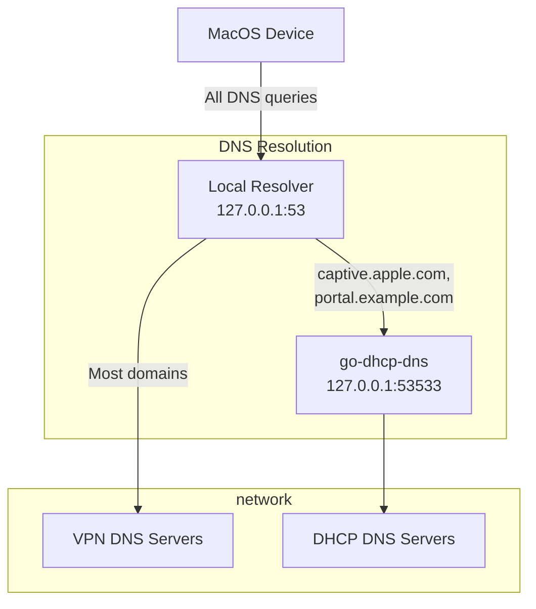

# go-dhcp-dns

A DNS proxy server for Darwin environments that enables selective DNS resolution through DHCP-provided DNS servers, particularly useful when working with VPNs and captive portals.

## Problem

In Darwin environments, it's challenging to configure selective DNS resolution using DHCP-propagated DNS servers for specific domains. This becomes problematic when:

- Using a local custom DNS server (e.g., through VPN)
- Needing to resolve specific domains through DHCP-provided DNS servers
- Dealing with captive portals that require local DNS resolution
- Managing split-DNS configurations

## Solution

go-dhcp-dns provides a lightweight DNS proxy that:

1. Discovers DNS servers from DHCP using system tools (`ipconfig`) without interfering with the built-in DHCP client
2. Proxies DNS queries to these DHCP-provided servers
3. Implements proper DNS caching with TTL support
4. Allows selective domain resolution through DHCP DNS servers while maintaining VPN connectivity

